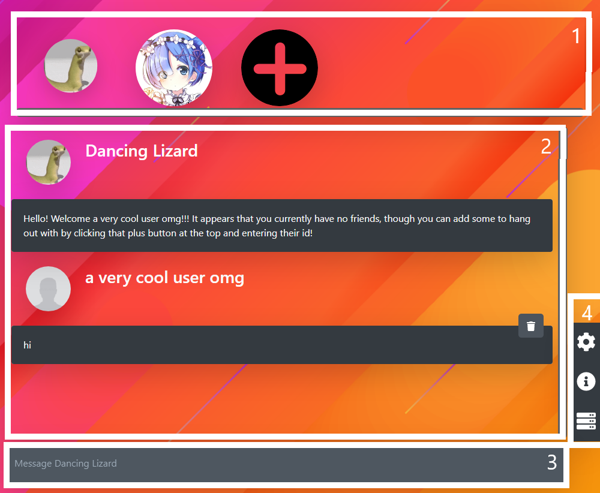
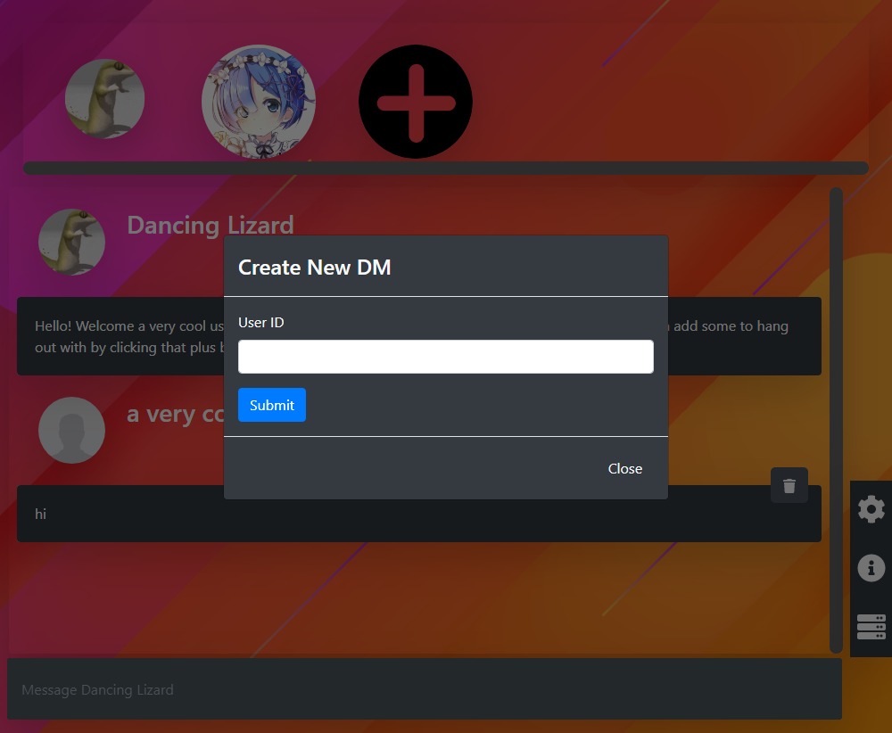
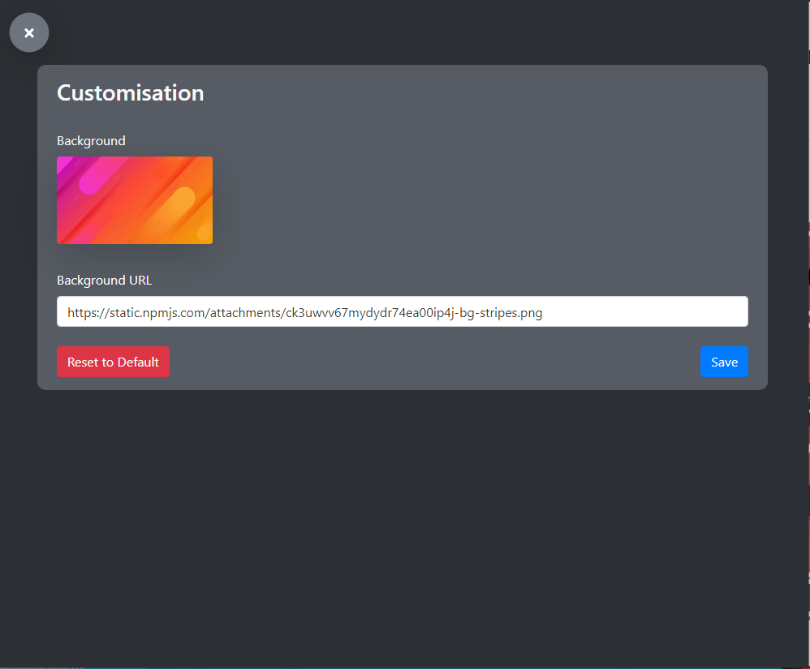
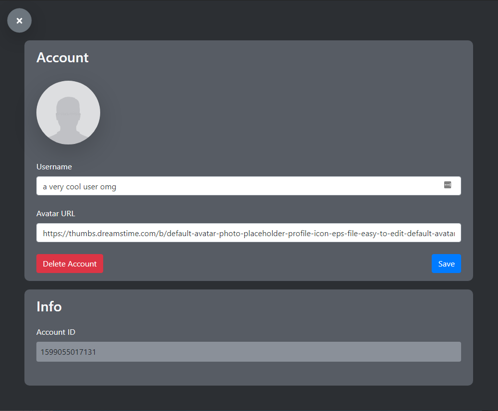

# Navigating the Platform

## Layout

## 1. DMs List

This box contains all your current DMs, and the icon of that DM is always the profile picture of the other user that the DM is to. The plus icon is not a channel. When clicked, it brings up a modal which allows you to input another user's ID and add them to your DMs list so you can start chatting with them.  

## 2. Messages

This area simply displays all your messages in the current channel and gives you some options for managing these messages, such as deleting your own.

## 3. Input Bar

Here you can input text to send to the user. There are a couple shortcuts provided by default for unicode character combinations. Simply add this to the beginning of your message:

* /tableflip
* /shrug
* /unflip

## 4. Options and Other Menus

These buttons bring up other menus.

* The first \(cog\) button brings up the customisation options

* The second \(info\) button brings up the user settings and account options

* The third \(server\) button currently does nothing, though this will be a way to create bot accounts in the future

