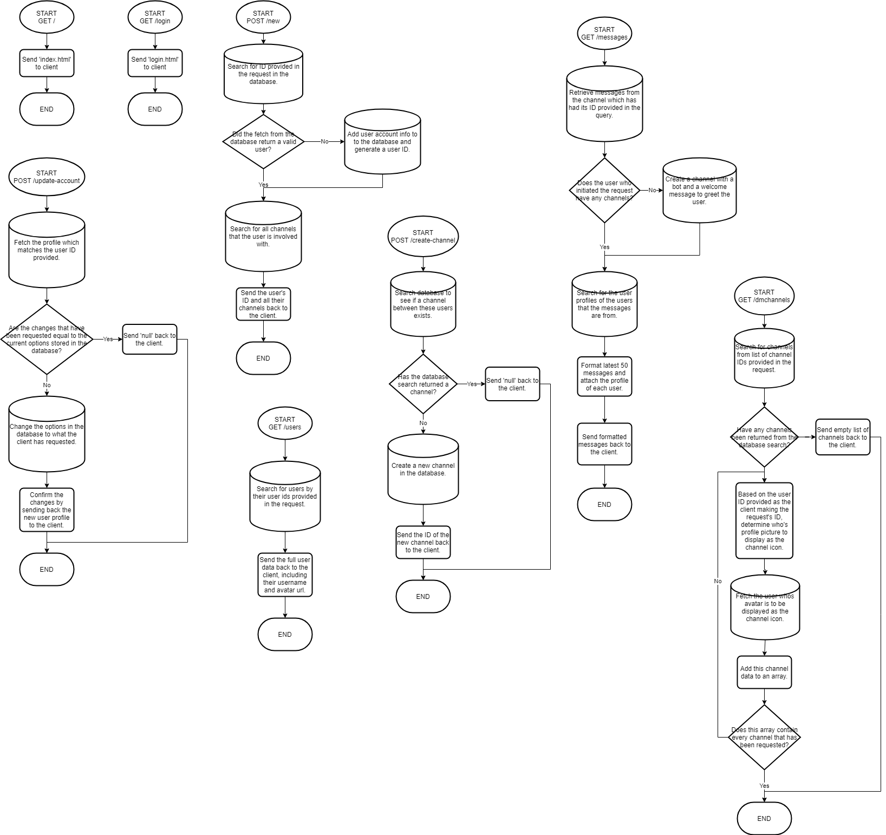

# API

## Connecting to the Websocket

We utilise Socket.IO for our websocket, so you must be using Socket.IO in order to connect else it will not work. You can check out how to connect with Socket.IO by checking out their [docs](https://socket.io/docs/).

In order to receive channel specific events, you must provide a list of channel IDs of the channels you'd like to listen to in the headers during the initial connection to the websocket in the format show below:

```http
1596546252413,1599079146709,1599080295208
```

You will not receive any real-time messages or updates about the channels if you do not provide their IDs here. Messages can still be fetched at any time.

All examples below assume the 'Authorisation' token is being sent in the headers and that the base URL has been set.

You must provide the 'Authorisation' token in the headers during the initial webhook connection, in the same way as endpoints. Connecting to the websocket will be successful even without a valid 'Authorisation' token, though you will simply not receive any events.

## Endpoints



New Session



This endpoint is used in order to create a new account, or login and fetch your account details and info including all your channels.






The ID of the account you are trying to login with. Only needed if you are trying to login, otherwise leave this empty.



Either the username you are trying to login with or a username for a new account.







New account creared successfully.


```javascript
{
    "id": "1596544373547", // id of the user
    "dms": [], // ids of dm channels that the user is in
    "token": "jO5Ob9NZvue9RG4-x-iEm1w8SDozfq_NBZvyOccpIsgS4V8OwTOIppQliD02hHq_Yw3pIZXH2YgM5y-Ig1k4vb-KB1rO0fIEW-223NeZRXZ8OAr-49Za4q4T99uEU_IMC1bkvNTKXolNQLhgD7wc8XquNh3-B4wMPUVHqjTNZzfirHqmG6NcedJRvlCDgnY2FOBZeTFrhHzyvFqI39huBc1GIlDjpiE9unyQ1cTrCmAqTNcNoVQcDaYqwV_QyMZi" // the authorisation token for this login session
}
```




Login details are correct.


```javascript
{    
    "id": "1596544373547", // id of the user
    "dms": ["1599058363394","1599080295208"], // ids of dm channels that the user is in
    "token": "jO5Ob9NZvue9RG4-x-iEm1w8SDozfq_NBZvyOccpIsgS4V8OwTOIppQliD02hHq_Yw3pIZXH2YgM5y-Ig1k4vb-KB1rO0fIEW-223NeZRXZ8OAr-49Za4q4T99uEU_IMC1bkvNTKXolNQLhgD7wc8XquNh3-B4wMPUVHqjTNZzfirHqmG6NcedJRvlCDgnY2FOBZeTFrhHzyvFqI39huBc1GIlDjpiE9unyQ1cTrCmAqTNcNoVQcDaYqwV_QyMZi" // the authorisation token for this login session
}
```




Account login details are incorrect.


```javascript
null
```




There was an error.


```javascript
null
```







Update Account



This endpoint is used to update account settings, such as the username and profile photo.






Authentication token to identify the user and check if they have permissions on this endpoint.





If this is not being updated, you must provide the current avatar URL. Otherwise if you are updating this, provide a new avatar URL.



If this is not being updated, you must provide the current username. Otherwise if you are updating this, provide a new username.







Returns the updated user.


```javascript
{    
    "id": "1596544373547", // the id of the user
    "username": "Starman", // the user's updated username
    "avatarURL": "https://cdn.discordapp.com/attachments/706554372565237790/750434410880565320/mypfpnocone.png" // the user's updated avatar url 
}
```




You have not provided the avatar URL or the username, or you have not provided an authorisation token.


```javascript
null
```




The provided authorisation token is not valid.


```javascript
null
```




You have provided details which are not updated.


```javascript
null
```




There was an error.


```javascript
null
```







Create Channel



Creates a new channel






Authentication token to identify the user and check if they have permissions on this endpoint.





The ID of the other user in the channel.



The type of channel to be created. Currently only DM channels are supported.  
1 == DM Channel







The channel was successfully created. The 'channelCreate' event will also be emitted to the other user\(s\) who are involved with the channel.


```javascript
{
    "channel_id": "1599079146709" // the id of the new channel
}
```




You have not provided either who the channel is to, the channel type or an authorisation token.


```javascript
null
```




The provided authorisation token is not valid.


```javascript
null
```




Channel between these users already exists.


```javascript
null
```




There was an error.


```javascript
null
```







Fetch Users



Fetch multiple users by their IDs.






Authentication token to identify the user and check if they have permissions on this endpoint.





An array of user IDs of the users you would like to fetch.







Returns an array of users. This is not guaranteed to be in the order they were requested in.


```javascript
{
    "users": [
        {
            "avatarURL": "https://cdn.discordapp.com/attachments/706554372565237790/750434410880565320/mypfpnocone.png", // the url of the user's avatar
            "id":  "1596544373547", // the user's id
            "username": "Starman" // the user's username
        },
        {
            "avatarURL": "https://cdn.discordapp.com/attachments/706554372565237790/750705138494341200/724927315737313300.gif", // the url of the user's avatar
            "id": "1", // the user's id
            "username": "Dancing Lizard" // the user's username
        }
    ]
}
```




You have provided an empty array of users, not provided the 'users' parameter at all or not provided the authorisation token.


```javascript
null
```




The provided authorisation token is not valid.


```javascript
null
```




No users that were provided were found.


```javascript
{
    "users": []
}
```




There was an error.


```javascript
null
```







Fetch Messages



Returns the last 50 messages from a channel, with the author of each messages attached to the message.






Authentication token to identify the user and check if they have permissions on this endpoint.





The ID of the channel to fetch the messages from. Provide 'undefined' here if the user has no channels.







The messages for the requested channel were found.


```javascript
{
  "messages": [
    {
      "content": "i am a crazy blob", // the content of the message
      "author": {
        "avatarURL": "https://cdn.discordapp.com/emojis/750716581360959659.gif?v=1", // the url of the message author's avatar
        "username": "Crazy Blob", // the username of the message author
        "id": "1599112863789" // the id of the message author
      },
      "id": "1596544419104", // the id of the message
      "channel_id": "1599058363394" // the id of the channel
    },
    {
      "content": "hi", // the content of the message
      "author": {
        "avatarURL": "https://cdn.discordapp.com/attachments/706554372565237790/750434410880565320/mypfpnocone.png", // the url of the message author's avatar
        "username": "Starman", // the username of the message author
        "id": "1596544373547" // the id of the message author
      },
      "id": "1599073440474", // the id of the message
      "channel_id": "1599058363394" // the id of the channel
    }
  ],
  "channel": { 
    "name": "Dancing Lizard", // the name of the channel
    "id": "1599058363394" // the id of the channel
  },
  "other_user": "1" // the id of the other user
}
```




'null' was provided in the 'channelID' parameter, so the default welcome channel is created and sent back to the user. The ID of the message will always be '0'.


```javascript
{
  "messages": [
    {
      "content": "Hello! Welcome Starman!!! It appears that you currently have no friends, though you can add some to hang out with by clicking that plus button at the top and entering their id!", // the content of the message
      "author": {
        "avatarURL": "https://cdn.discordapp.com/attachments/706554372565237790/750705138494341200/724927315737313300.gif", // the url of the message author's avatar
        "username": "Dancing Lizard", // the username of the message author
        "id": "1" // the id of the message author
      },
      "id": "0", // the id of the message
      "channel_id": "1599058363394" // the id of the channel
    }
  ],
  "channel": { 
    "name": "Dancing Lizard", // the name of the channel
    "id": "1599058363394" // the id of the channel
  },
  "other_user": "1" // the id of the other user
}
```




No authorisation token was provided.


```javascript
null
```




The provided authorisation token is not valid.


```javascript
null
```




There was an error.


```javascript
null
```







Fetch DM Channels



Fetch multiple DM channels by their IDs.






Authentication token to identify the user and check if they have permissions on this endpoint.





An array of DM channels IDs to fetch.







Returns the channels which were requested. They are not guaranteed to be in the order that they were requested in.


```javascript
{
    "dmchannels": [
        {
            "channel_id": "1599058363394", // the id of the channel
            "user": {
                "avatarURL": "https://cdn.discordapp.com/attachments/706554372565237790/750705138494341200/724927315737313300.gif", // the channel icon
                "id": "1", // the id of the other user
                "username": "Dancing Lizard" // the username of the other user
            }
        },
        {
            "channel_id": "1599080295208", // the id of the channel
            "user": {
                "avatarURL": "https://cdn.discordapp.com/attachments/706554372565237790/750434410880565320/mypfpnocone.png", // the channel icon
                "id": "1596544373547", // the id of the other user
                "username": "Starman" // the username of the other user
            }
        }
    ]
}
```




No channel IDs were provided or an authorisation token was not provided.


```javascript
null
```




The provided authorisation token is not valid.


```javascript
null
```




No channels were found.


```javascript
{
    "dmchannels": []
}
```




There was an error.


```javascript
null
```





## Events

These can be both emitted and received by the client. They must take a certain format, else the events will not be emitted to other clients.

### message

Send structure:

```javascript
{
    "content": "hello world", // the message content
    "channel": "1596546252413" // the id of the channel that the message was sent to
}
```

Receive structure:

```javascript
{
    "author": {
        "avatarURL": "https://cdn.discordapp.com/attachments/706554372565237790/750434410880565320/mypfpnocone.png", // the avatar url of the message author
        "id": "1596544373547", // the id of the message author
        "username": "Starman" // the username of the message author
    },
    "channel_id": "1596546252413", // the id of the channel that the message is from
    "content": "hello world", // the message content
    "id": "1599144969319" // the id of the message
}
```

### messageDeleted

Send structure:

```javascript
{
    "channel" "1596546252413", // the id of the channel that the message is from
    "id": "1596544419104" // the id of the message to be deleted
}
```

Receive structure:

```javascript
{
    "channel": "1596546252413", // the id of the channel that the message is from
    "id": "1596544419104" // the id of the message to be deleted
}
```

### channelCreate

Send structure:

This event is only emitted by the server to the client when a channel is created using the `/create-channel` endpoint.

Receive structure:

```javascript
{
    "channel_id": "1596546252413" // the id of the channel that was created
}
```

## Flowcharts



